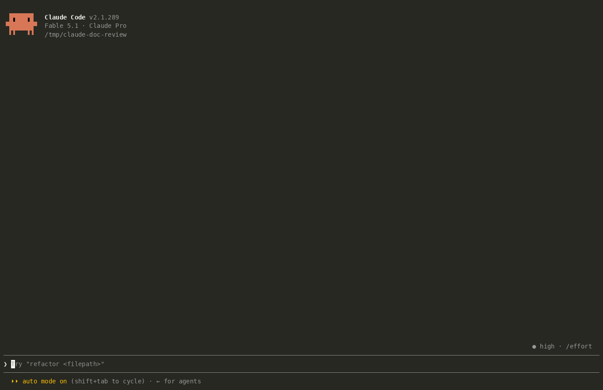

# claude-doc-review

**Review Claude's design docs and plans like a pull request, without leaving
the terminal.**

When Claude writes a spec or a plan and says "please review it", you usually
scroll the file, then type a long reply that quotes the parts you mean.
claude-doc-review opens the document in a pane beside the conversation
instead. You step through it block by block, pin comments on single
paragraphs, bullets or table rows, and ask side questions that never enter
the main conversation. When you're done, every comment goes back to Claude as
one review.



<sub>Recorded with asciinema in a real terminal, reviewing this repo's own
[DESIGN.md](DESIGN.md). To replay it at full fidelity, run
`asciinema play docs/demo.cast`.</sub>

## Why

- **One review, one revision.** All comments go back as a single prompt,
  each one anchored by heading path and quote. Claude revises the document
  once and keeps it coherent, instead of patching it piece by piece.
- **Side questions stay on the side.** "What does this paragraph mean?"
  doesn't belong in the main transcript. Asks are answered by a fork of the
  session, which reuses the cached prefix, so they're cheap and leave no
  trace in the conversation.
- **Comments land exactly where you mean.** Every heading, paragraph, list
  item, table and code fence is its own stop, and comments follow their
  passage when Claude edits the file.

## Install

One line, from any shell:

```sh
claude plugin marketplace add revelationnow/claude-doc-review && claude plugin install doc-review@claude-doc-review
```

Or from inside Claude Code:

```
/plugin marketplace add revelationnow/claude-doc-review
/plugin install doc-review@claude-doc-review
```

Then start a new session, or run `/reload-plugins` in an open one. This works
the same in the terminal, the desktop app and VS Code. The settings below all
have defaults, so the "userConfig options not yet set" note after installing
can be ignored.

To update or remove it later:

```sh
claude plugin marketplace update claude-doc-review && claude plugin update doc-review@claude-doc-review
claude plugin uninstall doc-review@claude-doc-review
```

## Quick start

Open any markdown file for review. Type `@` to pick it with Claude Code's
file completion instead of typing the path:

```
/doc-review @docs/superpowers/specs/2026-10-04-widgets-design.md
```

You can also skip the command. When a plugin such as
[superpowers](https://github.com/obra/superpowers) writes a spec or plan and
asks for a review, the pane opens by itself.

## What it does

| | |
| --- | --- |
| **Spots specs and plans** | A `Write` or `Edit` to a path that matches the configured globs marks the file as a candidate. When Claude's turn ends with a review request or names the file, the pane opens. |
| **`/doc-review [path]`** | Opens any markdown file, or the latest candidate when no path is given. |
| **Blocks, not lines** | Each heading, paragraph, list item (nested ones too), code fence, table and quote is a focus stop. |
| **Tables and code never wrap** | Tables are drawn as aligned grids and code as highlighted code, both cut at the pane's edge. A scrollbar under each wide block pans it sideways with the mouse, or use `p`. |
| **Anchored comments** | A comment remembers its heading path and opening text, so it survives revisions. If its passage is deleted, the comment is kept and marked orphaned. |
| **Side questions** (`a`) | By default, answered by `model.fork` over the session's own transcript, so the model knows the conversation and the prefix is cached. Click `via this conversation` next to the field to send questions to `sonnet`, `haiku` or `opus` instead, which answer from the document alone. Each answer shows its output and cached token counts. In a fresh session, a forked question goes to the session model with the whole document attached. |
| **Explain** (`h`) | A fresh small model (`haiku` by default) explains the passage in plain words. It sees only the passage and the document's title, so it costs a few hundred tokens. |
| **Escalate** | Under each answer: *keep as comment*, *send to conversation* (with the passage attached as hidden context), or *dismiss*. |
| **Submit or approve** | `s` sends every comment as one review. `o` sends your approval phrase and can fold unsent comments in as non-blocking notes. |
| **Live refresh and diff** | When Claude edits the open file, the pane re-reads it and re-anchors comments. Changed blocks get a `+` in the margin, `n` jumps between them, and `d` shows the diff against the version you reviewed. |
| **Persistence** | Comments, answered questions and the last-reviewed text are saved per document across sessions, for the twelve most recently touched documents. `/doc-review forget [path]` clears one. |
| **Find and cycle** | `f` finds text. `m` cycles through blocks that have comments. `g` and `e` jump to the top and end. |

## Keys

Hotkeys work while the pane has the keyboard. It opens focused from
`/doc-review`; otherwise click it or press `ctrl+x tab`.

| Key | Action |
| --- | --- |
| `j` / `k` | Next / previous block |
| `g` / `e` | Top / end |
| `f` | Find; press again for the next match |
| `m` | Next block with a comment or question |
| `Tab` / `Shift+Tab` | Walk the blocks and their actions |
| `c`, or `Enter` on the current marker | Comment |
| `a` | Ask a side question |
| `h` | Explain on a small model |
| `p` | Pan a wide table or code block sideways |
| `s` | Submit all comments as one review |
| `o` | Approve |
| `n` / `d` / `r` | Next changed block / toggle diff / mark as reviewed (shown only after a revision) |
| `x` / `Esc` | Close the pane (comments are kept) |

## Mouse

The mouse works wherever the surface reports it: fullscreen terminal, the
desktop app and VS Code.

- **Click a block's marker** (`·`) to select it. Click the current marker
  (`▶`) to comment.
- **Hover a block** to show `comment · ask · explain` in the gap under it.
  Showing the row doesn't shift the layout.
- **Every key has a button**, including the toolbar, the answer actions, the
  ✕ on a comment, and the approve dialog.
- **The wheel scrolls the pane.** Documents with more than 200 blocks are
  drawn as a window around the current block, and the wheel moves the window
  at its edges.
- **Wide tables and code** have a bar under them: `‹ ───━━━━━─── › 41–88/102`.
  Click the track to jump there, or click `‹` and `›` to step a screen at a
  time.

## Configuration

Set these in `/config` or under `pluginConfigs.doc-review` in settings.

| Option | Default | Meaning |
| --- | --- | --- |
| `globs` | superpowers specs and plans, `docs/plans`, `docs/specs`, `*-design.md`, `*-plan.md`, `SPEC.md`, `PLAN.md` | Comma-separated globs of documents that count |
| `offer` | `auto` | `auto` opens the pane when a review is requested. `toast` only shows a toast and status line. `off` means `/doc-review` only. |
| `approvePhrase` | `Looks good, proceed.` | What `o` sends as your words |
| `askModel` | `session` | Where side questions go by default. `session` forks this conversation. Any model alias or id answers from the document alone. |
| `explainModel` | `haiku` | The model alias or id behind `h` |

With `auto`, a pane that opens without a user action needs a terminal at
least 144 columns wide (110 once you've opened it yourself). On a narrower
terminal you get a toast pointing at `/doc-review`, which opens the pane at
any width.

## Where it runs

| Surface | Support |
| --- | --- |
| Terminal, fullscreen | Docked pane, keys and mouse |
| Terminal, main screen | Inline pane above the prompt, keys only |
| Desktop app (Code tab) | Docked pane, mouse, and the app's own text field and Markdown |
| VS Code | Same as the desktop app |
| Mobile | Comment and ask through the question dialog |

The marketplace install above covers every surface. To run a local checkout
instead, for example while hacking on it, use one of:

- `claude --plugin-dir ./doc-review` for a single terminal session.
- `CLAUDE_CODE_PLUGIN_DIRS` set to the folder's absolute path in the `env`
  block of `~/.claude/settings.json`, for every session including desktop and
  VS Code. Add `"CLAUDE_CODE_PLUGIN_DIR_WATCH": "1"` to hot-reload edits.
- `claude plugin marketplace add ./` from the checkout, then install as
  above. A folder marketplace is read in place, so `/reload-plugins` picks up
  edits.

## Developing

```sh
claude plugin validate doc-review   # what the engine will load and refuse
claude plugin test doc-review       # 41 tests, no terminal needed
npx -p typescript@5 tsc -p doc-review
```

Type-checking needs the API declarations that the engine writes under
`doc-review/.claude-plugin/types/` the first time the mod loads in a session.
The tests mount every view on the terminal, desktop and VS Code surfaces.

```
doc-review/
  .claude-plugin/plugin.json   manifest, userConfig, types contract
  hooks/hooks.json             names the hooks module
  hooks/register.tsx           the hooks: tool.call, turn.complete, command.run, ui.*
  hooks/blocks.ts              markdown to blocks; anchors and re-anchoring
  hooks/diff.ts                line diff, unified hunks, changed-block detection
  hooks/persist.ts             the shape of the per-document store record
  hooks/review-prompt.ts       the review, ask, escalation and approval texts
  types/index.d.ts             the state contract ($.state under 'doc-review')
  tests/review.test.ts         claude plugin test
.claude-plugin/marketplace.json  makes the repo a plugin marketplace
docs/demo.gif, docs/demo.cast    the recording above
DESIGN.md                        the design and the reasoning behind it
LICENSE                          Apache License 2.0
```

Two engine rules matter when you edit the mod:

- `$` is followed only into functions declared in the same file. A helper in
  another module can't take `$`, which is why `persist.ts` holds only shapes
  and the store calls live in `register.tsx`.
- An atom's reference must be written as string literals at the call site.

### Deliberately not built

- **A vim-style `Client` module** (phase 3 of the design). Button hotkeys
  already cover every key on every surface. A `Client` only receives keys
  after a click gives it focus, and only on terminal and desktop.
- **A draggable scrollbar.** It was built as a `Client` and removed. Clicking
  a `Client` gives it the keyboard, so `j`, `k` and Tab stopped reaching the
  pane. The bar is now a row of Buttons, which can't trap the keys.
- **Tests for hover.** The test kit drops hover styling, so the hover reveal
  is type-checked and validated but not tested. The tests do press the
  hidden actions and check that each block has exactly one action row.

## License

[Apache License 2.0](LICENSE).
